# Pathway Graph

<!-- GENERATED FILE — do not edit by hand.
     Regenerate: python3 scripts/validate_pathway.py --mermaid > planning/04-pathway-graph.md
     CI fails if this file is stale relative to curriculum/pathway.yaml. -->

Prerequisite DAG for the full programme, grouped by earliest-availability
semester. An arrow A → B means A is a prerequisite of B. Colors: blue = core,
pink = AI track, green = Systems track, amber = Security track, gray = general
elective.

```mermaid
flowchart TD
  subgraph S1["Semester 1"]
    CS1101["CS1101<br/>Programming Fundamentals"]:::core
    CS1102["CS1102<br/>Computer Systems Fundamentals"]:::core
    MA1101["MA1101<br/>Discrete Mathematics"]:::core
    MA1102["MA1102<br/>Calculus for Computing"]:::core
  end
  subgraph S2["Semester 2"]
    CS1201["CS1201<br/>Data Structures & Algorithms I"]:::core
    CS1202["CS1202<br/>Systems Programming"]:::core
    CS1203["CS1203<br/>Software Construction & Tooling"]:::core
    MA1201["MA1201<br/>Linear Algebra"]:::core
  end
  subgraph S3["Semester 3"]
    CS2101["CS2101<br/>Algorithm Design & Analysis"]:::core
    CS2102["CS2102<br/>Computer Architecture"]:::core
    CS2103["CS2103<br/>Software Engineering"]:::core
    MA2101["MA2101<br/>Probability & Statistics for CS"]:::core
  end
  subgraph S4["Semester 4"]
    CS2201["CS2201<br/>Operating Systems"]:::core
    CS2202["CS2202<br/>Data Management & Databases"]:::core
    CS2203["CS2203<br/>Theory of Computation"]:::core
    CS2204["CS2204<br/>HCI & Visual Computing"]:::core
    EL_MOBILE["EL-MOBILE<br/>Mobile & Cross-Platform Development"]:::elective
  end
  subgraph S5["Semester 5"]
    CS3101["CS3101<br/>Computer Networks"]:::core
    CS3102["CS3102<br/>Machine Learning"]:::core
    CS3103["CS3103<br/>Programming Languages"]:::core
    CS3104["CS3104<br/>Security Fundamentals"]:::core
    EL_GRAPH["EL-GRAPH<br/>Computer Graphics"]:::elective
    EL_QUANT["EL-QUANT<br/>Quantum Computing"]:::elective
  end
  subgraph S6["Semester 6"]
    CS3201["CS3201<br/>Parallel & Distributed Computing"]:::core
    CS3202["CS3202<br/>LLM Application Engineering"]:::core
    CS3203["CS3203<br/>Large-Scale Software & DevOps"]:::core
    AI_DL["AI-DL<br/>Deep Learning"]:::ai
    EL_ROBOT["EL-ROBOT<br/>Robotics & Embedded AI"]:::elective
    SEC_CRYPTO["SEC-CRYPTO<br/>Applied Cryptography"]:::security
    SEC_NET["SEC-NET<br/>Network Security"]:::security
    SEC_OFFDEF["SEC-OFFDEF<br/>Offensive Security for Defenders"]:::security
    SEC_PRIV["SEC-PRIV<br/>Privacy Engineering"]:::security
    SEC_SSD["SEC-SSD<br/>Secure Software Development"]:::security
    SYS_ADV["SYS-ADV<br/>Advanced Operating Systems"]:::systems
    SYS_COMP["SYS-COMP<br/>Compilers"]:::systems
    SYS_DBI["SYS-DBI<br/>Database Internals"]:::systems
    SYS_PERF["SYS-PERF<br/>Performance Engineering"]:::systems
  end
  subgraph S7["Semester 7"]
    CS4101["CS4101<br/>Computing, Ethics & Society"]:::core
    CS4901["CS4901<br/>Capstone I"]:::core
    AI_MLOPS["AI-MLOPS<br/>MLOps & Production ML"]:::ai
    AI_NLP["AI-NLP<br/>NLP & Large Language Models"]:::ai
    AI_RL["AI-RL<br/>Reinforcement Learning"]:::ai
    AI_SAFE["AI-SAFE<br/>AI Safety & Alignment"]:::ai
    SYS_CLOUD["SYS-CLOUD<br/>Cloud Infrastructure & Virtualization"]:::systems
  end
  subgraph S8["Semester 8"]
    CS4902["CS4902<br/>Capstone II"]:::core
  end
  CS3102 --> AI_DL
  CS3102 --> AI_MLOPS
  CS3203 --> AI_MLOPS
  AI_DL --> AI_NLP
  CS3102 --> AI_RL
  MA2101 --> AI_RL
  CS3102 --> AI_SAFE
  CS1101 --> CS1201
  MA1101 --> CS1201
  CS1101 --> CS1202
  CS1102 --> CS1202
  CS1101 --> CS1203
  CS1201 --> CS2101
  MA1101 --> CS2101
  CS1202 --> CS2102
  CS1203 --> CS2103
  CS2102 --> CS2201
  CS1202 --> CS2201
  CS1201 --> CS2202
  MA1101 --> CS2203
  CS1203 --> CS2204
  CS2201 --> CS3101
  MA1201 --> CS3102
  MA2101 --> CS3102
  CS1201 --> CS3102
  CS1202 --> CS3103
  CS2203 --> CS3103
  CS2201 --> CS3104
  CS3101 --> CS3201
  CS2201 --> CS3201
  CS3102 --> CS3202
  CS2103 --> CS3202
  CS2103 --> CS3203
  CS2202 --> CS3203
  CS2103 --> CS4101
  CS3203 --> CS4901
  CS4901 --> CS4902
  MA1201 --> EL_GRAPH
  CS1201 --> EL_GRAPH
  CS1203 --> EL_MOBILE
  MA1201 --> EL_QUANT
  CS3102 --> EL_ROBOT
  MA1102 --> MA1201
  MA1102 --> MA2101
  CS3104 --> SEC_CRYPTO
  MA1101 --> SEC_CRYPTO
  CS3104 --> SEC_NET
  CS3101 --> SEC_NET
  CS3104 --> SEC_OFFDEF
  CS3101 --> SEC_OFFDEF
  CS3104 --> SEC_PRIV
  CS3104 --> SEC_SSD
  CS2103 --> SEC_SSD
  CS2201 --> SYS_ADV
  CS3201 --> SYS_CLOUD
  CS3103 --> SYS_COMP
  CS2202 --> SYS_DBI
  CS2201 --> SYS_DBI
  CS2102 --> SYS_PERF
  CS2201 --> SYS_PERF
  classDef core fill:#dbeafe,stroke:#1e40af,color:#1e3a8a
  classDef ai fill:#fce7f3,stroke:#9d174d,color:#831843
  classDef systems fill:#dcfce7,stroke:#166534,color:#14532d
  classDef security fill:#fef3c7,stroke:#92400e,color:#78350f
  classDef elective fill:#e5e7eb,stroke:#374151,color:#1f2937
```

## Semester load (core credits)

Track-elective slots (3 credits each) sit on top of semesters 6–8; free
elective in semester 8.

| Semester | Core credits |
|---|---|
| 1 | 15 |
| 2 | 15 |
| 3 | 15 |
| 4 | 14 |
| 5 | 14 |
| 6 | 10 |
| 7 | 7 |
| 8 | 5 |
